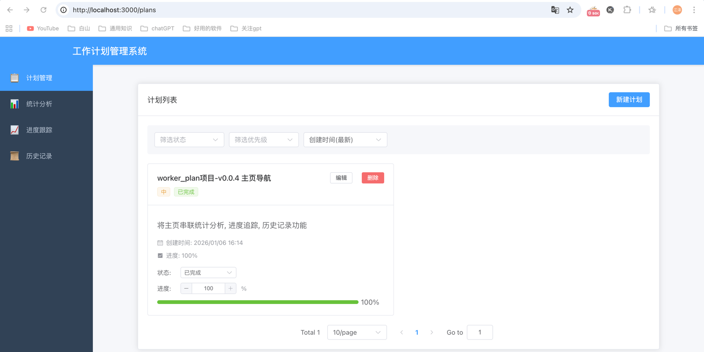

# 项目概述
做一个工作计划项目, 用于帮助用户规划, 跟踪, 统计工作计划

# 工程要求
- 后端语言: go
- 前端语言: vue
- 数据库: postgres
  - 库: gorm

# AI工具要求
- 使用claude code 的 OpenSpec 来完成该功能
- 要求尽量不手动编程, 尽量使用AI+规范驱动来完成该功能
- 
# 功能特性

## 主页导航
系统提供统一的主页导航,用户可以通过主页快速访问所有功能模块:

- **计划管理** ✅: 管理和跟踪工作计划
- **统计分析** ⏳: 查看工作计划的统计数据
- **进度跟踪** ⏳: 跟踪计划进度和完成情况
- **历史记录** ⏳: 查看操作历史和变更记录

### 导航菜单
- 左侧固定侧边栏导航
- 自动高亮当前页面
- 响应式设计,移动端可折叠
- 支持键盘导航

### 主页功能卡片
- 展示所有功能模块
- 点击卡片快速跳转到对应页面
- 悬停效果和动画
- 响应式网格布局

## 计划管理 ✅
- 创建、编辑、删除工作计划
- 设置计划优先级和状态
- 跟踪计划进度
- 到期提醒功能

